Einleitung
==========

Im Rahmen der Kassensicherungsverordnung (KassenSichV) müssen Registrierkassen
Belege manipulationsgeschützt abspeichern.

Hierzu werden Technische Sicherheitseinrichtungen (TSE) eingesetzt.

fiskaltrust.Middleware bietet die bequeme Einbindung von TSE aller Hersteller an
Ihre Registrierkasse, sowie eine vereinfachte Umsetzung der Anforderungen der
Digitalen Schnittstelle der Finanzverwaltung für Kassensysteme (DSFinV-K).

Neben der kostenlosen fiskaltrust.Middleware bieten wir AddOn-Produkte an, die
den Kassenalltag sehr erleichtern, beispielsweise durch automatisiertes
Speichern der Kassendaten mit Konformitätserklärung und DATEV-Schnittstelle,
auch im Rahmen attraktiver Sorglos-Pakete.

Dieses Dokument bietet einen Schnelleinstieg, wie Sie die von Ihnen genutzte TSE
im Portal einrichten müssen.

Begrifflichkeiten
-----------------

CashBox Konfigurationscontainer (Auswahl TSE, Betriebssystem u.a.)

Launcher App zum Installieren der Middleware auf Kassenrechner

Middleware Dienstprogramm (Service/Daemon; läuft auf Kassenrechner)

TSE Technische Sicherheitseinrichtung (zur Verschlüsselung)

Dokument Status
---------------

| Rev | Änderung                                                    | geändert von            | Änderungsdatum |
|-----|-------------------------------------------------------------|-------------------------|----------------|
| 00  | Dokumenterstellung, Swissbit                                | Kaya Cürünay, Lars Mach | 09.03.2020     |
| 01  | Version 1.0                                                 | Kaya Cürünay            | 13.03.2020     |
| 02  | Erweiterung Cryptovision, Installation, Test der Middleware | K. Daniel               | 17.03.2020     |
| 03  | Erweiterung Fiskaly                                         | K. Daniel               | 18.03.2020     |

Swissbit
========

Einrichten TSE
--------------

1.  Wählen Sie im Portal den Punkt TSE / Signatur-Erstellungs-Einheit

    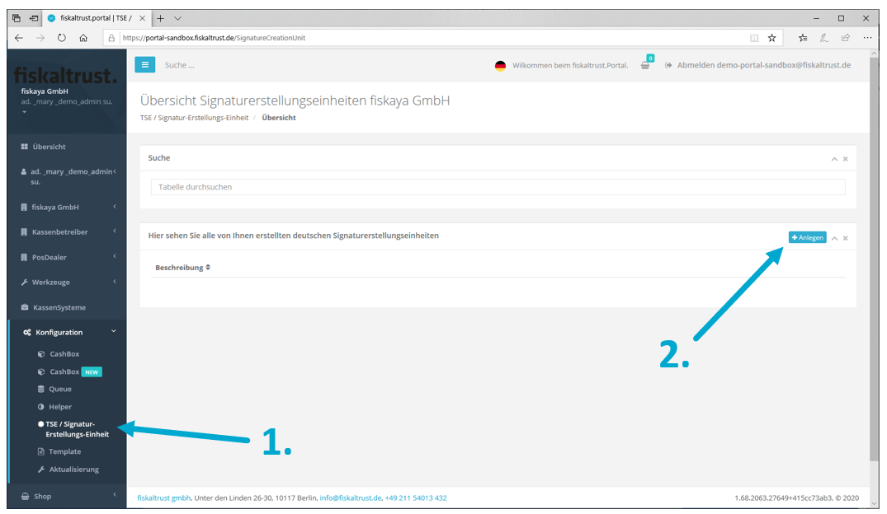

2.  Klicken Sie auf „+Anlegen“

3.  Tragen Sie unter „Beschreibung“ Ihrer TSE einen Namen

4.  Wählen Sie als „Package Name“ die „fiskaltrust.Middleware.SCU.DE.Swissbit“
    aus

5.  Wählen Sie die „Package Version“ 1.3.0-rc2 aus (alternativ die neueste)

6.  Klicken Sie auf „Speichern“

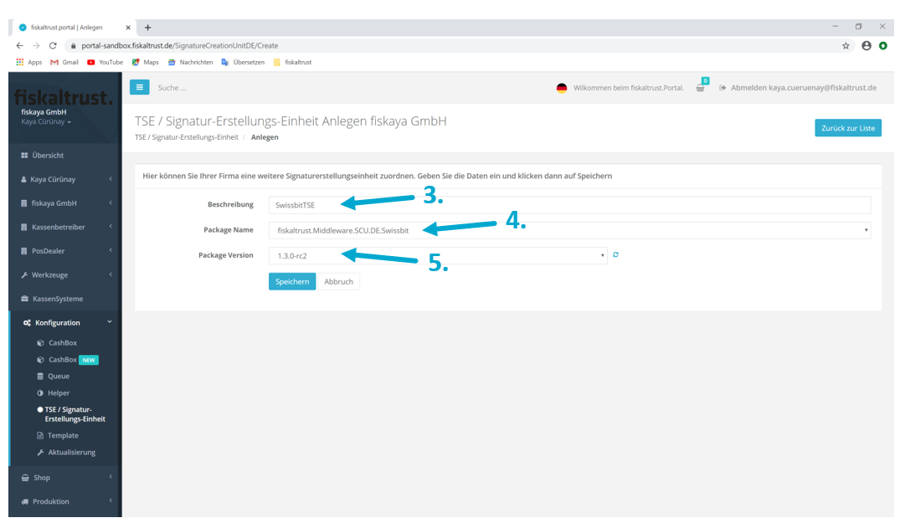

1.  Stecken Sie die Swissbit TSE in einen USB Anschluss Ihrer Kasse;

    prüfen Sie, welchen Laufwerksbuchstaben Ihr Betriebssystem der TSE
    zugewiesen hat

2.  Fügen Sie einen Schlüssel „**devicePath**“ hinzu und nennen den
    Laufwerksbuchstaben als Wert (im Beispiel „D:“ **ohne Schrägstrich**).

3.  Tragen Sie **grpc://localhost:10104** ein

    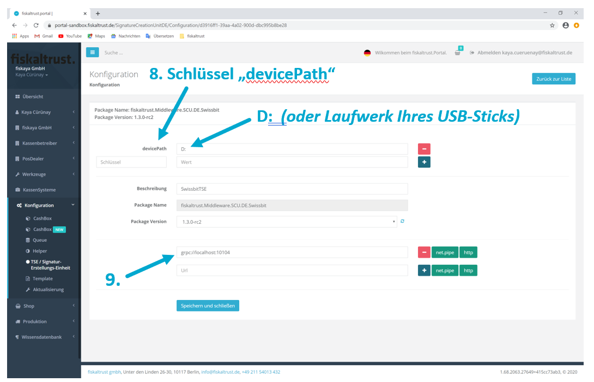

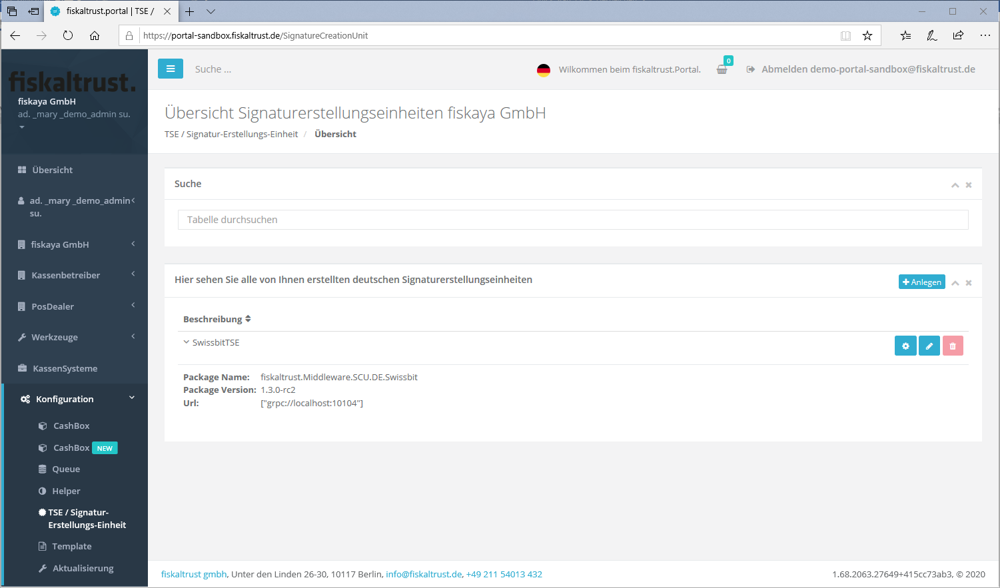

Klicken Sie auf „Speichern und schließen“ Sie gelangen dann zur Übersicht

Einrichten Queue
----------------

1.  Klicken Sie auf der linken Seite auf Queue und legen anschließend wie im
    „QuickStart Guide“ beschrieben (siehe Seite 7) eine neue Queue mit folgenden
    Werten an:

    http://localhost:1200/fiskaltrust  
    grpc://localhost:10103

    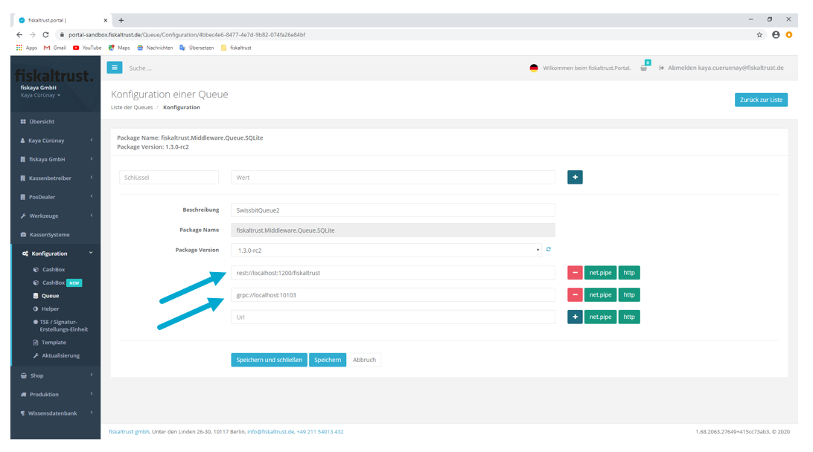

2.  Im zweiten Queue-Eingabefenster ist „CashBoxIdenficiation“ zu nennen;  
    hier können Sie bei Verwendung einer Swissbit-TSE eine beliebige Bezeichnung
    wählen,  
    **achten Sie aber darauf, nicht mehr als 20 Zeichen zu verwenden!**

    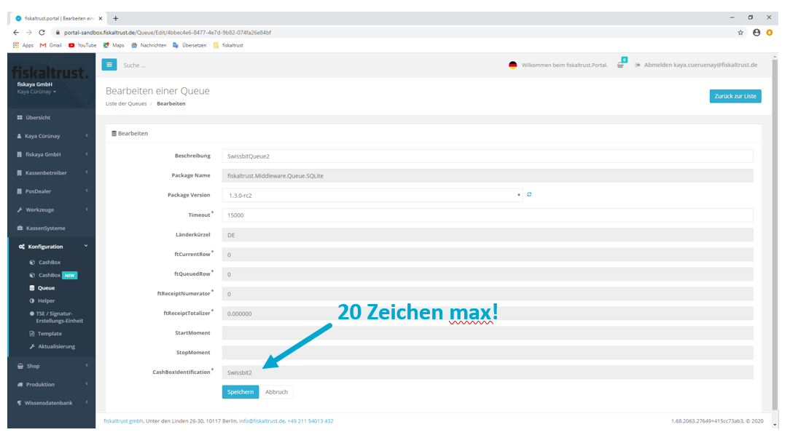

3.  Klicken Sie auf „Speichern“

Zusammenstellen CashBox 
------------------------

Um die Casbox Konfiguration abzuschließen, klicken Sie unter dem Menüpunkt
Konfiguration\|CashBox den Button „+Hinzufügen“.

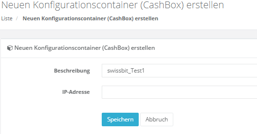

Vergeben Sie unter Beschreibung einen treffenden Namen für Ihre Cashbox und
klicken Speichern.

In der Übersicht der Konfigurationscontainer im Menü „CashBox“ finden Sie Ihre
CashBox mit dem von Ihnen vergebenen Beschreibungsnamen, hier beispielsweise
„swissbit_Test1“.

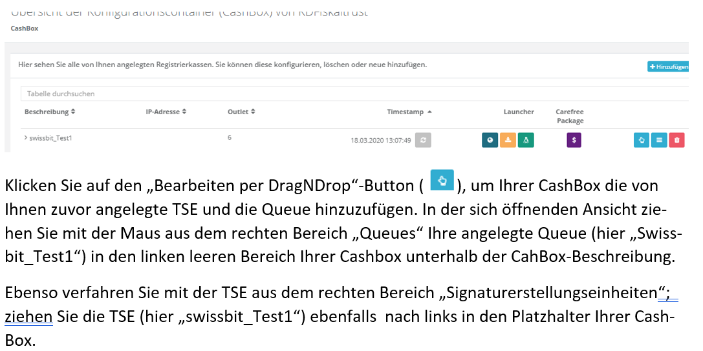

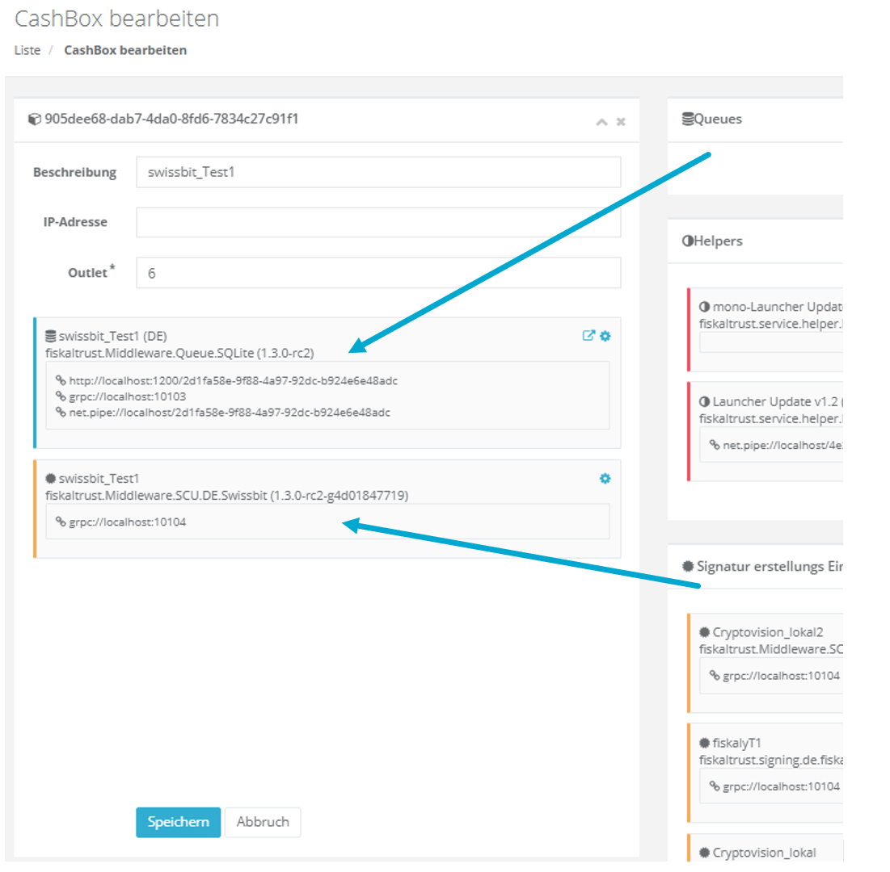

Speichern Sie die CashBox-Konfiguration durch Klick auf den Speichern Button im
unteren Bereich des Formulars.

Sie gelangen zurück in die Übersichtsliste der Cashboxen:

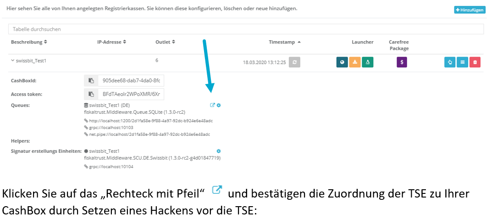

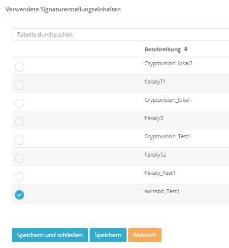

Mit „Speichern und schließen“ beenden Sie das Formular.

Schließen Sie die Cashbox Konfiguration ab, indem Sie auf den „Rebuild
Configuration“ Button klicken:

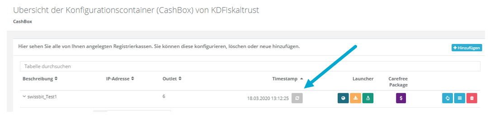

Sie haben die Einrichtung einer TSE und einer CashBox abgeschlossen. Um Ihre
Konfiguration zu testen lesen Sie bitte Kapitel „[Installation und Start der
Middleware](#installation-und-start-der-middleware)“.

Cryptovision Bundesdruckerei
============================

Im folgenden werden die einzelnen Konfigurationsschritte beschrieben, um eine
CryptoVision TSE mit der fiskaltrust Middleware zu nutzen.

Logen Sie sich dazu auf unser Portal ein (für Test:
<https://portal-sandbox.fiskaltrust.de/Account/Login> für Produktion unter
<https://portal.fiskaltrust.de/Account/Login>).

Einrichten TSE
--------------

Unter Konfiguration\|TSE Signatur-Erstellungseinheit klicken sie den Button
„+Anlegen“, um eine neue TSE zu konfigurieren:

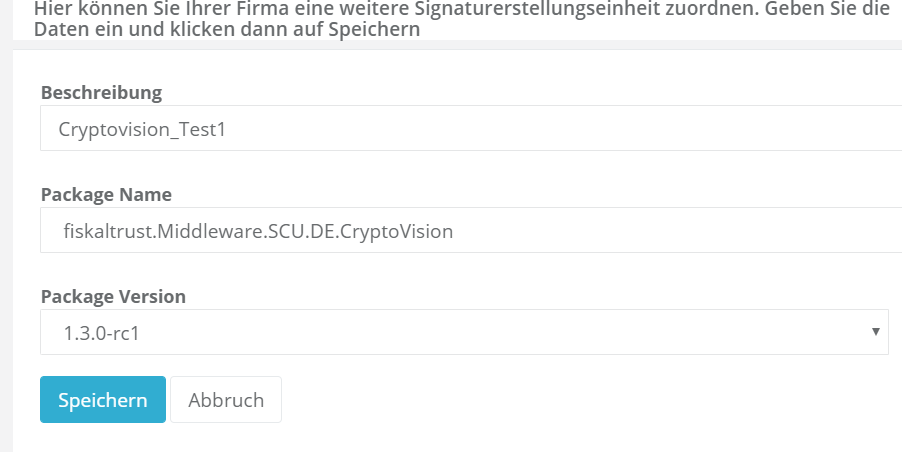

Vergeben Sie einen Namen in der Beschreibung.

Wählen Sie ein Package, das im Namen „CryptoVision“ enthält.

Es wird in der Package Version die aktuelle Version vorgeblendet, übernehmen Sie
diese.

Klicken Sie auf Speichern. Es erscheint folgende Ansicht um weitere Angaben
einzutragen:

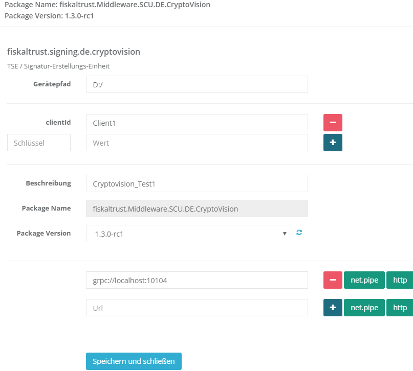

Geben Sie unter „Gerätepfad“ den Laufwerksbuchstaben ein, unter dem sich die TSE
beim Einstecken am Betriebsystem der Kasse anmeldet (hier z.B. „D:/“).

Tragen Sie zusätzlich den Schlüssel „cliendId“ mit einem eindeutigen Wert ein,
der noch keiner anderen TSE Konfiguration vergeben wurde, hier beispielsweise
„Client1“. Dazu klicken Sie anschließend auf den Plus-Button

.

Im Unteren Bereich geben sie „grpc://localhost:10104“ als Endpunkt für die
Kommunikation unserer Middleware mit der TSE ein und klicken anschließend auf
den Plus-Button

.

Speichern Sie die Einstellungen zur TSE durch Klick auf „Speichern und
Schließen“.

Einrichten Queue
----------------

Unter dem Menüpunkt Konfiguration\|Queue klicken Sie den Button „+Neu anlegen“
um eine für die Cashbox benötigte „Queue“ anzulegen.

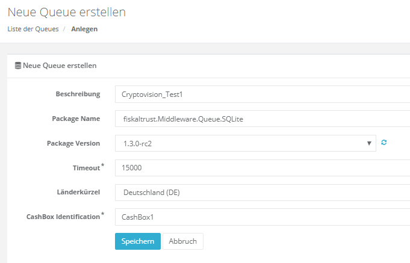

Vergeben Sie bei der Beschreibung einen Namen für die Queue, hier z.B.
„Cryptovision_Test1“.

Als Standard werden Ihnen hier weitere Werte voreingestellt, die Sie i.d.R. nur
übernehmen:

-   Package Name (fiskaltrust.Middleware.Queue.SQLite)

-   Package Version (1.3.0…)

-   Timeout (1500)

-   Länderkürzel (Deutschland (DE))

In dem Feld „CashBox Identification“ vergeben Sie bitte einen eindeutigen Namen,
hier z.B. „CashBox1“.

Drücken Sie auf Speichern, um Ihre Einstellungen zur Queue zu sichern. Es
erscheint eine weitere Konfigurationsseite zur Queue, in der Sie die
Kommunikationsendpunkte eintragen, mit welchem Protokoll Sie als
Kassenhersteller (Entwickler) mit unserer Middleware kommunizieren:

Beschreibung, Package Name und Version wurden aus der vorhergehenden Seite
übernommen.

Wir haben hier beispielhaft alle Endpunktmöglichkeiten eingetragen. Mindestens
einer ist notwendig:

Klick auf „http“: http://localhost:1200/...

Manuell eingetragen: grpc://localhost:10103 und „+“-Button drücken

Klick auf „net.pipe“: net.pipe://localhost/…

Klicken Sie „Speichern und Schließen“ um die Einstellungen zur Queue
abzuschließen.

Zusammenstellen Cashbox
-----------------------

Um die Konfiguration abzuschließen, klicken Sie unter dem Menüpunkt
Konfiguration\|CashBox den Button „+Hinzufügen“.

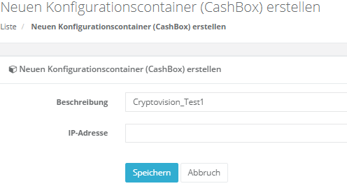

Vergeben Sie unter Beschreibung einen treffenden Namen für Ihre Cashbox und
klicken Speichern.

In der Übersicht der Konfigurationscontainer im Menü „CashBox“ finden Sie Ihre
CashBox mit dem von Ihnen vergebenen Beschreibungsnamen, hier beispielsweise
„Cryptovision_Test1“.

Klicken Sie auf den „Bearbeiten per DragNDrop“-Button (

), um Ihrer CashBox die von Ihnen zuvor angelegte TSE und die Queue
hinzuzufügen. In der sich öffnenden Ansicht ziehen Sie mit der Maus aus dem
rechten Bereich „Queues“ Ihre angelegte Queue (hier „Cryptovision_Test1“) in den
linken leeren Bereich Ihrer Cashbox unterhalb der CahBox-Beschreibung.

Ebenso verfahren Sie mit der TSE aus dem rechten Bereich
„Signaturerstellungseinheiten“; ziehen Sie die TSE (hier „Cryptovision_Test1“)
ebenfalls nach links in den Platzhalter Ihrer CashBox.

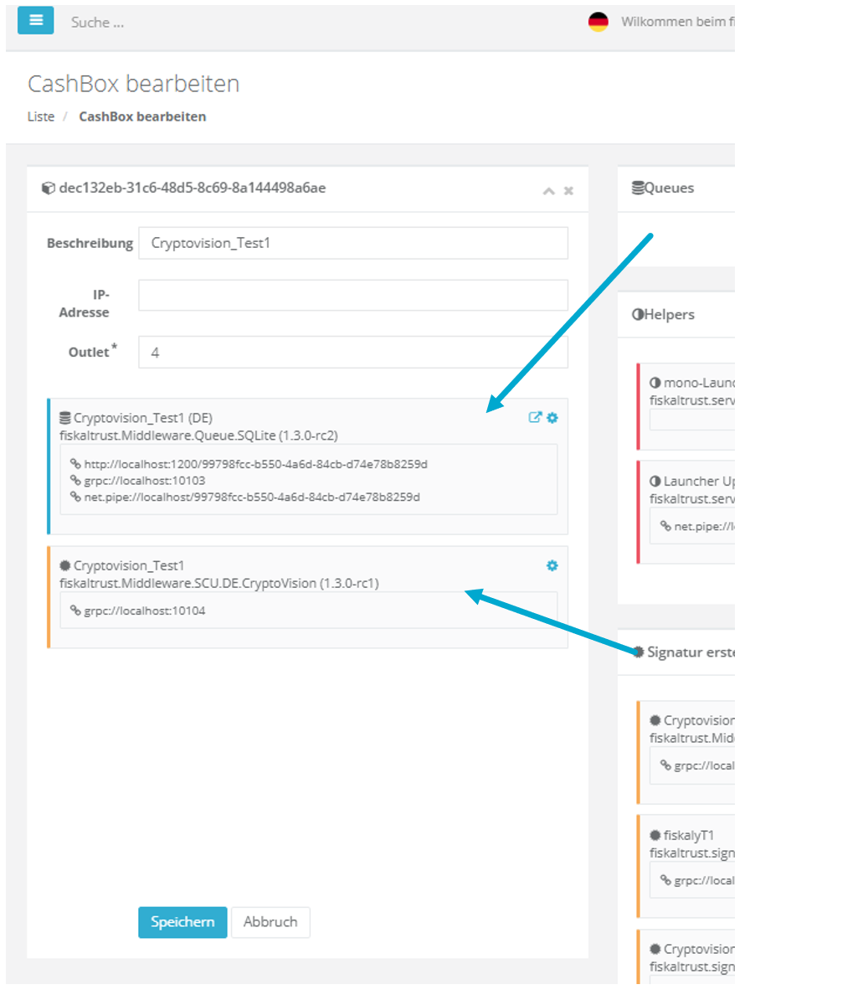

Speichern Sie die CashBox-Konfiguration durch Klick auf den Speichern Button im
unteren Bereich des Formulars.

Sie gelangen zurück in die Übersichtsliste der Cashboxen:

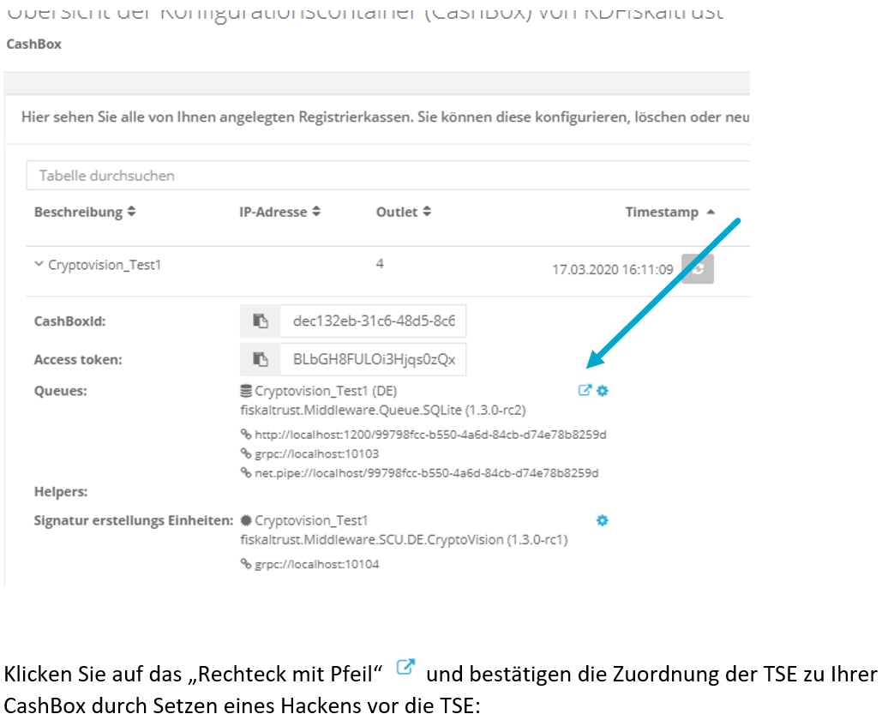

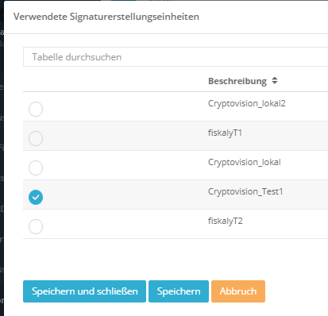

Mit „Speichern und schließen“ beenden Sie das Formular.

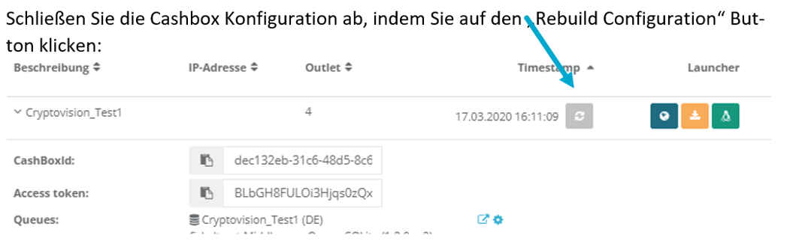

Sie haben die Einrichtung einer TSE und einer CashBox abgeschlossen. Um Ihre
Konfiguration zu testen lesen Sie bitte Kapitel „[Installation und Start der
Middleware](#installation-und-start-der-middleware)“.

Fiskaly Online TSE
==================

Zur Einrichtung einer Fiskaly Online TSE werden Ihnen von fiskaltrust oder
Fiskaly folgende Zugangsschlüssel bereitgestellt: ApiKey, ApiSecret, TssId,
ClientId.

Also beispielsweise:

ApiKey: test_1iwrxfk97b9qx6ufn9q9yw8ce_klausdaniel

ApiSercret: THBtRTuNOFo9sjw4iir1HysVbPsHjpGz2OQH8GyPvNM

TSSID: 3ee521cf-bd8d-470e-9e56-3aa928265f80

ClientId: 3b97103e-ade5-402a-9651-e35c0ca847d8

Einrichten TSE
--------------

Unter Konfiguration\|TSE Signatur-Erstellungseinheit klicken sie den Button
„+Anlegen“, um eine neue TSE zu konfigurieren:

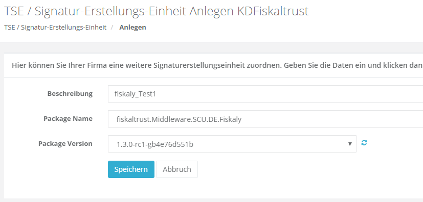

Vergeben Sie einen Namen in der Beschreibung, z.B. „fiskaly_Test1“.

Wählen Sie ein Package, das im Namen „Fiskaly“ enthält.

Es wird in der Package Version die aktuelle Version vorgeblendet, übernehmen Sie
diese.

Klicken Sie auf Speichern. Es erscheint folgende Ansicht um weitere Angaben
einzutragen.

Tragen Sie die Werte für TSS-ID, API-Schlüssel und Geheimer API-Schlüssel ein:

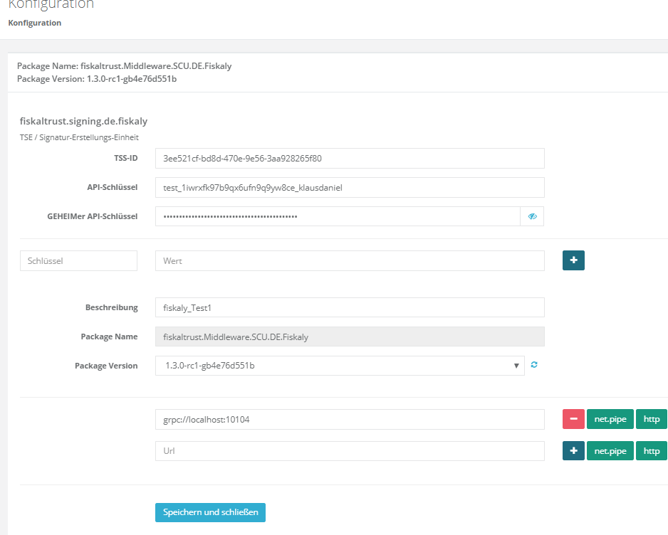

Im Unteren Bereich geben sie „grpc://localhost:10104“ als Endpunkt für die
Kommunikation unserer Middleware mit der TSE ein und klicken anschließend auf
den Plus-Button

.

Speichern Sie die Einstellungen zur TSE durch Klick auf „Speichern und
Schließen“.

Einrichten Queue
----------------

Unter dem Menüpunkt Konfiguration\|Queue klicken Sie den Button „+Neu anlegen“
um eine für die Cashbox benötigte „Queue“ anzulegen.

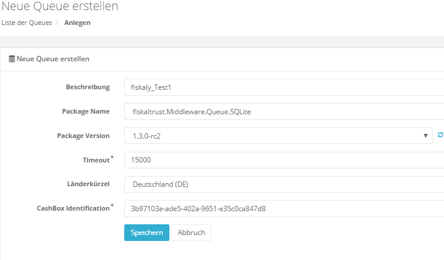

Vergeben Sie bei der Beschreibung einen Namen für die Queue, hier z.B.
„fiskaly_Test1“.

Als Standard werden Ihnen hier weitere Werte voreingestellt, die Sie i.d.R. nur
übernehmen:

-   Package Name (fiskaltrust.Middleware.Queue.SQLite)

-   Package Version (1.3.0…)

-   Timeout (1500)

-   Länderkürzel (Deutschland (DE))

*In dem Feld „CashBox Identification“ tragen Sie die ClientId ein,* hier z.B.
„3b97103e-ade5-402a-9651-e35c0ca847d8“.

Drücken Sie auf Speichern, um Ihre Einstellungen zur Queue zu sichern.

Es erscheint eine weitere Konfigurationsseite zur Queue, in der Sie die
Kommunikationsendpunkte eintragen. Damit legen Sie fest, mit welchem Protokoll
Sie als Kassenhersteller (Entwickler) mit unserer Middleware kommunizieren:

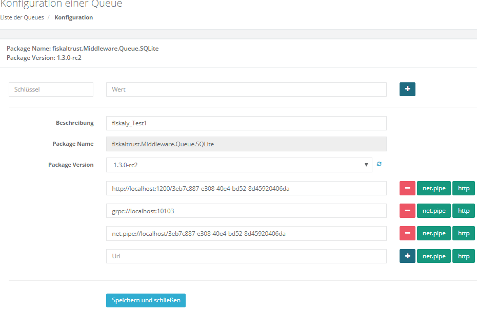

Beschreibung, Package Name und Version wurden aus der vorhergehenden Seite
übernommen.

Wir haben hier beispielhaft alle Endpunktmöglichkeiten eingetragen. Mindestens
einer ist notwendig:

Klick auf „http“: http://localhost:1200/...

Manuell eingetragen: grpc://localhost:10103 und „+“-Button drücken

Klick auf „net.pipe“: net.pipe://localhost/…

Klicken Sie „Speichern und Schließen“ um die Einstellungen zur Queue
abzuschließen.

Zusammenstellen Cashbox
-----------------------

Um die Konfiguration abzuschließen, klicken Sie unter dem Menüpunkt
Konfiguration\|CashBox den Button „+Hinzufügen“.

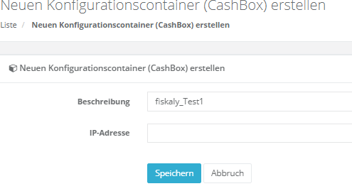

Vergeben Sie unter Beschreibung einen treffenden Namen für Ihre Cashbox und
klicken Speichern.

In der Übersicht der Konfigurationscontainer im Menü „CashBox“ finden Sie Ihre
CashBox mit dem von Ihnen vergebenen Beschreibungsnamen, hier beispielsweise
„Fiskaly_Test1“.

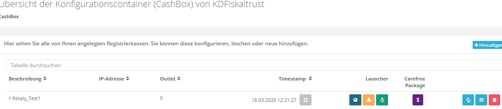

Klicken Sie auf den „Bearbeiten per DragNDrop“-Button (

), um Ihrer CashBox die von Ihnen zuvor angelegte TSE und die Queue
hinzuzufügen. In der sich öffnenden Ansicht ziehen Sie mit der Maus aus dem
rechten Bereich „Queues“ Ihre angelegte Queue (hier „Fiskaly_Test1“) in den
linken leeren Bereich Ihrer Cashbox unterhalb der CahBox-Beschreibung.

Ebenso verfahren Sie mit der TSE aus dem rechten Bereich
„Signaturerstellungseinheiten“; ziehen Sie die TSE (hier „Fiskaly_Test1“)
ebenfalls nach links in den Platzhalter Ihrer CashBox.

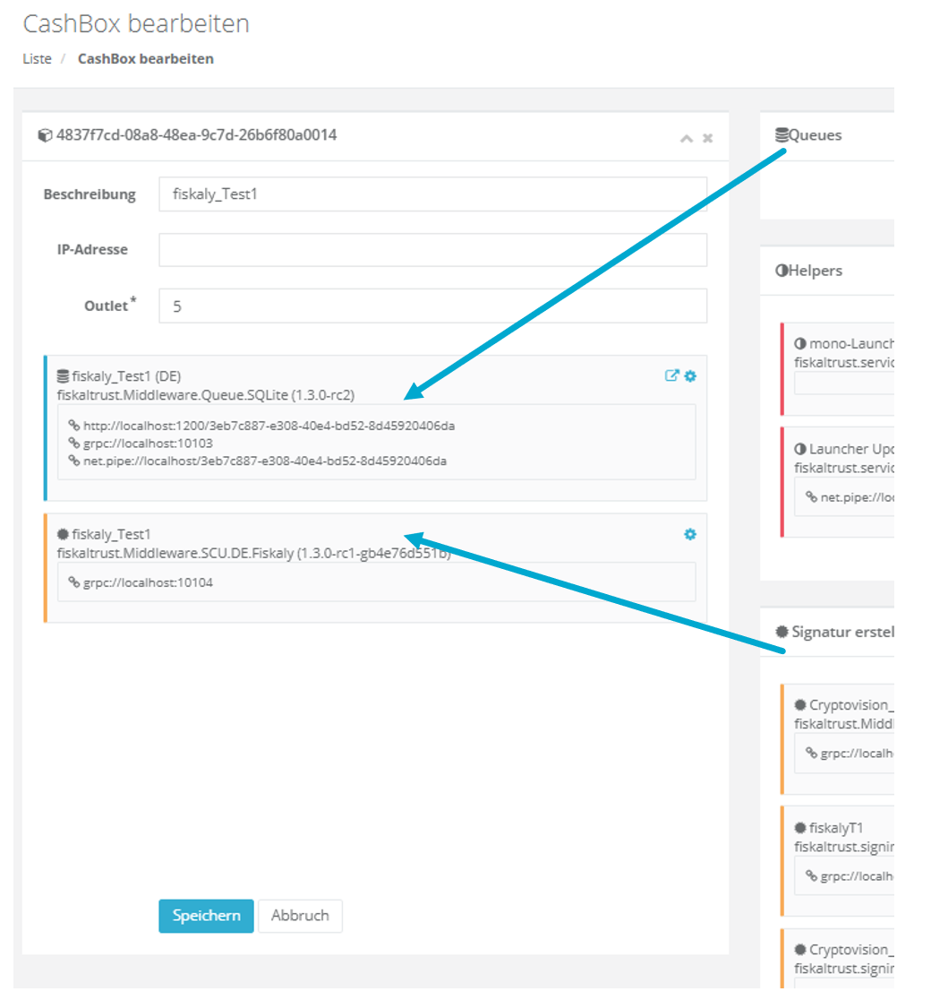

Speichern Sie die CashBox-Konfiguration durch Klick auf den Speichern Button im
unteren Bereich des Formulars.

Sie gelangen zurück in die Übersichtsliste der Cashboxen:

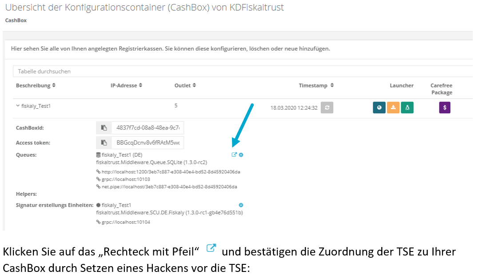

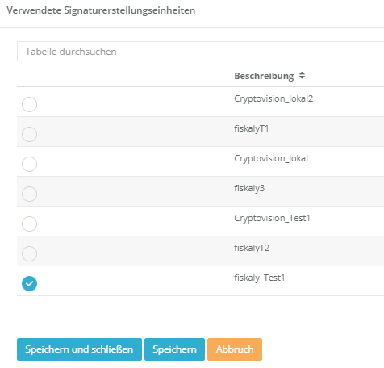

Mit „Speichern und schließen“ beenden Sie das Formular.

Schließen Sie die Cashbox Konfiguration ab, indem Sie auf den „Rebuild
Configuration“ Button klicken:

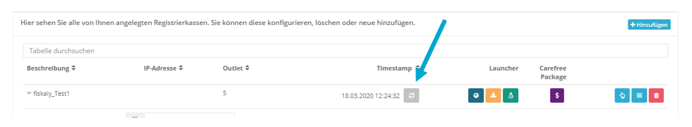

Sie haben die Einrichtung einer TSE und einer CashBox abgeschlossen. Um Ihre
Konfiguration zu testen lesen Sie bitte Kapitel „[Installation und Start der
Middleware](#installation-und-start-der-middleware)“.

Installation und Start der Middleware
=====================================

Über den Menüpunkt Konfiguration\|CashBox gehen Sie in die Übersichtsliste Ihrer
Cashboxen. Laden Sie den „Launcher“ zur passenden CashBox als Zip-Datei auf
Ihren Rechner

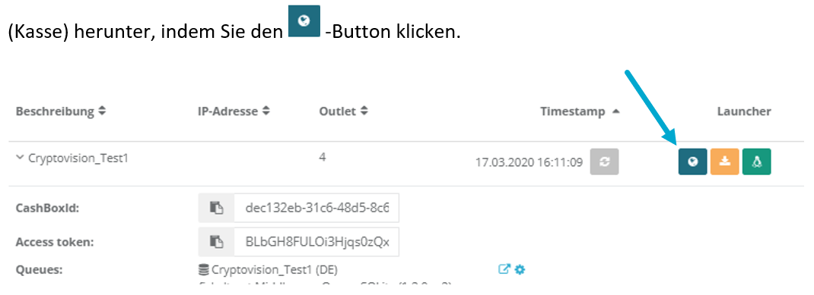

Entpacken Sie die Zip-Datei.

Stecken Sie Ihre TSE (USB-Stick oder MicroSD-Karte) an Ihren Rechner und stellen
Sie sicher, dass der verwendete Laufwerksbuchstabe, dem der
Cashbox-Konfiguration entspricht (z.B. „D:“) .

Starten Sie die Middleware zu Testzwecken mit dem Kommandozeilenbefehl
„Test.cmd“ mit Administratorrechten.

Alternativ installieren Sie unsere Middleware dauerhaft als Windows-Dienst auf
die Kasse, indem Sie den Kommandozeilenbefehl „install-service.cmd“ mit
Administratorrechten eingeben.

Der mit Test.cmd gestartete Launcher sucht zunächst nach Updates und startet
dann unsere Middleware. Hierbei wird u.a. angezeigt, welche Cashbox-Id genutzt
wird und welche Endpunkte zur möglichen Nutzung konfiguriert sind.

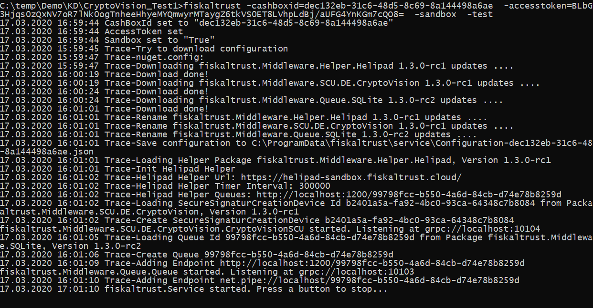

Mit der Zeile „fiskaltrust.Service started. Press a button to stop...“ ist
unsere Middleware bereit Anfragen seitens der Kassensoftware oder eines
Test-Clients entgegen zu nehmen.

Funktionstest der Middleware und TSE
====================================

Nachdem unsere Middleware wie in den zuvor durchgeführten Schritten konfiguriert
und mit „test.cmd“ mit Administratorrechten gestartet ist, können verschiedene
Programme zum Test genutzt werden:

-   Unsere Middleware Demo in der verschiedenste Kommunikationsprotokolle
    genutzt werden und auch viele JSON Business Case Beispiele zum Test
    beiliegen: <https://github.com/fiskaltrust/middleware-de-demo-dotnet>

-   Mit dem frei erhältlichen Programm „Postman“

-   Mit dem frei erhältlichen Programm „SoapUI“

-   Mit der eigenen Kassensoftware

So können Anfragen an den gestarteten Dienst gesendet werden (Belege signieren,
Journaldaten abrufen oder ein einfaches „echo“ zum Testen der
Aufrufschnittstellen).

Endpunkte für Aufrufe
---------------------

Die Endpunkte der fiskaltrust.Middleware für Client Aufrufe sind

>   baseUrl (lt.Portal)/v0/journal  
>   baseUrl (lt.Portal)/v1/sign  
>   baseUrl (lt.Portal)/v1/echo  
>     
>   Für JSON-Aufrufe baseUrl (lt.Portal)/json/v0/journal  
>   baseUrl (lt.Portal)/json/v1/sign  
>   baseUrl (lt.Portal)/json/v1/echo  
>     
>   Für XML-Aufrufe baseUrl (lt.Portal)/xml/v0/journal  
>   baseUrl (lt.Portal)/xml/v1/sign  
>   baseUrl (lt.Portal)/xml/v1/echo

**Beispiel:
http://localhost:1200/bbe97288-3b95-414d-953a-e2de95174729/json/v1/sign**

Beispiel Postman:

Zum Testen senden wir ein Start-Receipt zum einmaligen Initialisieren einer
neuen Kasse:

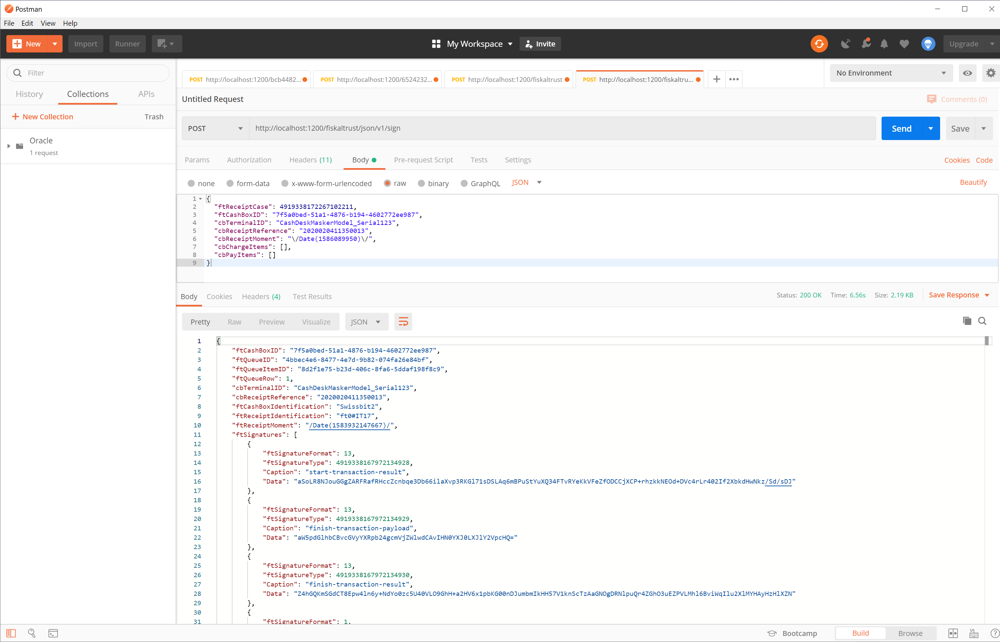

Zusätzliche Dokumentationen & Support
=====================================

Wichtige Dokumente
------------------

Unseren Quick Guide finden Sie unter

<https://fiskaltrust.de/dokumente/>

FAQ
---

Das Benutzerhandbuch sowie eine Dokumentation der fiskaltrust.Middleware nebst
Code-Sammlungen für Aufrufe liegen unter <https://fiskaltrust.de/faq>.

JSON Beispiel Dokumentation
---------------------------

Weitere Dokumentation und Beispiele in JSON finden Sie in unseren Dokumenten

Deutsch: „[fiskaltrust Geschäftsvorfälle in
JSON](https://fiskaltrust.de/wp-content/uploads/sites/5/2020/02/fiskaltrust-Business-Cases-in-JSON_deutsch-2.pdf)“.

Englisch: „[fiskaltrust Business
Cases](https://fiskaltrust.de/wp-content/uploads/sites/5/2020/02/fiskaltrust-Business-Cases-in-JSON_englisch.pdf)“

Interface Dokumentation
-----------------------

Darüber hinaus finden Sie weitere Hinweise und den gesamten Befehlssatz der
Middleware in unseren Schnittstellen-Dokumentation:

„[fiskaltrust-Interface-Doc](https://fiskaltrust.de/wp-content/uploads/sites/5/2020/02/fiskaltrust-interface-doc_2020-02-19.pdf)“

Support
-------

Bei Fragen steht Ihnen der fiskaltrust-Support unter <info@fiskaltrust.de> zur
Verfügung.
