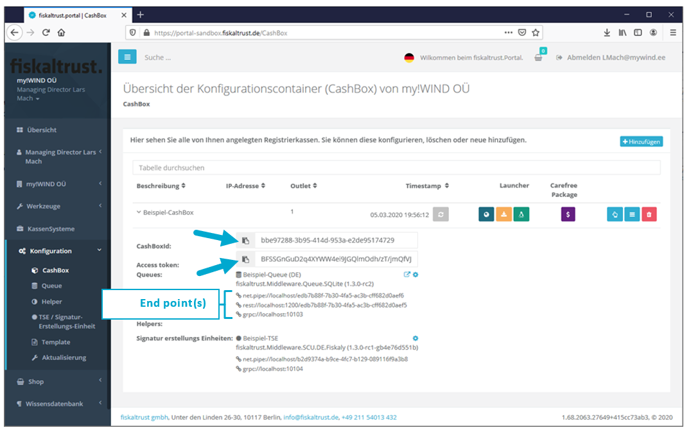

Introduction
============

According to Kassensicherungsverordnung (KassenSichV) cash registers must
electronically store receipts in a manipulation protected way.

Technical Safety Equipment (TSE) is used for that purpose.

fiskaltrust.Middleware enables easy integration of TSE by different makers to
your cash register next to simplified implementation of requirements of the
financial authority’s digital interface (Digitale Schnittstelle der
Finanzverwaltung für Kassensysteme, DSFinV-K).

On top of our free fiskaltrust.Middleware we offer AddOn products to facilitate
every day’s operation of a cash register, such as automatic long-term data
storage incl. conformity declaration and DATEV-interface, available through
carefree packages.

This document is a quick guide. For detailed information on the
fiskaltrust.Portal’s functionality there is a user manual.

User manual, a (middleware) interface documentation and code examples for
request calls can be found at <https://fiskaltrust.de/dokumente>.

Terminologies
-------------

CashBox Configuration container (selected TSE, operating system etc.)

Launcher App to install the middleware on the cash register computer

Middleware Service/daemon; runs in background on cash register computer

TSE Technical Security Equipment (for encryption)

Document status
---------------

| Rev | Changes                            | Edited by                 | Date of change |
|-----|------------------------------------|---------------------------|----------------|
| 01  | Translation from German to English | Henrik Hovanec, Lars Mach | 03-16-2020     |

Basic steps
===========

Fiscalising a cash register through our fiskaltrust.Middleware  
is accomplished by four major steps:

Registration in portal

Log-in data by e-mail

Configure CashBox

Selection of TSE, operating system etc.

Download CashBox

Download and start CashBox (middleware) on cash register

Send requests to middleware

Send receipt-/process data, receive response (signature)

Sign up to the fiskaltrust.Portal
=================================

Before starting we invite you to sign up to our fiskaltrust.Portal for free.

You find the link button on our website <https://fiskaltrust.de> next to the
menu.

During registration process a set with your organisation’s data will be stored
next to access information to our portal.

*A confirmation link will be sent to you by email; please click for activation.*

*Registration is prerequisite for access to our portal*

You get

-   free support (set up, implementating DSFinV-K)

-   an environment for development („sandbox“)

-   configuration of free fiskaltrust.Middleware

-   access to a webshop for fiskaltrust add-on-services and TSE

The extensive tools and available options of our fiskaltrust.Portal are
described on the following pages.

**Sign up to fiskaltrust.portal:**

1.  open PORTAL (https://fiskaltrust.de, upper right)

2.  click „Registrieren“

3.  submit your organisation’s data

4.  receive confirmation email, click activation link therein

5.  assign your personal password on the resulting portal opening site

Portal: Structure and functions
-------------------------------

The portal contains functions such as configuring cashboxes next to determining
roles (POS operator, -dealer, -producer), providing access to your data (with
editing function), a list of your POS systems, a web-shop and many more.

For a more in depth introduction into the full functionality of the portal,
please use the handbook at <https://fiskaltrust.de/faq/dokumente>.

Roles
-----

The portal differentiates between several roles, each one linked to different
functionality.

-   *Click on Übersicht/Overview under your account and choose your role.*

When you activate the slider bar, the corresponding contract pops up that
requires you to sign in order to take on your role. After accepting the contract
you will receive a separate email. The contract can be viewed and downloaded on
the portal.

-   **KassenHersteller / POS Creators**

Developers of POS Systems

-   **KassenHändler / POS Dealers**

Dealers of POS Systems

-   **KassenBetreiber / POS Operators**

User of a POS System (restaurant, shop, etc.)

-   **KassenBerater / POS Consultant**

business consultant, tax advisor etc.

More than one role can apply and be selected, such as POS Creator and POS
Dealer.

CashBox configuration
=====================

A CashBox is a configuration container that consolidates individually assigned
components for the fiscalisation of a POS system and allocates it to the
identification number (“CashBoxID”). These components can be TSEs of various
manufacturers, as well as “helpers” for extending the functionality of the
CashBox.

You can apply changes to the CashBox and its components after the configuration
on the portal – even exchange components such as the “helper”.

To add and configure a new CashBox you need to register in our Sandbox – our
testing environment at <https://portal-sandbox.fiskaltrust.de>

Adding a new CashBox
--------------------

On the left hand side menu, click on „Konfiguration / Configuration“ to get to
the overview, then choose „CashBox“ and and „Hinzufügen / Add“ in the top right
corner.

Enter your name into the text field „Beschreibung / Description“ and click on
„Speichern / Save“. You can leave the field „IP-Adresse“ empty.

Your CashBox will now be shown in the CashBox overview.

Queue configuration
-------------------

The queue collects the receipts and is responsible for the receipt block
chaining. It enables the receipt journal and the action journal. On the left
hand side menu, click on „Queue“, followed by „Add New“ in the top right
corner“:

Enter your queue name into the field „Beschreibung / Description“ and choose the
appropriate database package (e.g. fiskaltrust.Middleare.Queue.SQLite for
Windows).

*Please pay special attention to the value used in “CashBox Identification”!*

*Attention! The CashBox Identification is not the same as the CashBoxID
(CashBox).*

For a better understanding term in the queue menu will be renamed soon.

  
*The content of „CashBox Identification“ in the queue depends on the chosen
TSE:*

-   Cryptovision „CashBox Identification“ value is arbitrary

In the next step a key is to be added

-   fiskaly „CashBox Identification“ = „client ID” (assigned by fiskaly)

-   Swissbit [information to follow]

After clicking on „Speichern / Save“ you will receive the following screen:

http, net.pipe and grpc are available for communication with the queue.  
**! For the use of Cryptovision TSE, grpc may not be top of the list.**  
**There MUST BE a grpc end point in the queue, even when alternatives such as**  
**rest:// are intended to be used.**

The URLs are automatically generated after selection (exception: grpc, data see
above).  
Please ensure *not using identical URLs* (i.e. change these manually, if
needed).

Click on „Speichern und Schließen / Save and Close“.  
Your queue is now listed in the queue overview.

*The middleware on the POS System will communicate with the queue to send
requests and receive responses.*

Helpers
-------

Helpers are optional components that may be added to the CashBox to extend
functionality (e.g. the mono-launcher for usage with LINUX).

In the following image all the helpers are listed. This list will be updated
regularly.

*The use of a helper is not required for the middleware to run in this quick
guide. The helper reference is only for informative purposes here.*

Assign and configure TSE 
-------------------------

After configuring a CashBox and assigning a queue, a TSE is to be selected and
assigned to the queue.

The Technische Sicherheitseinrichtung (TSE) is used to sign receipts and save
receipt data in the TSE itself.

The list of TSEs we offer on our portal matches the list of available TSEs on
the market. Currently, on the fiskaltrust.Portal you will find the following
TSEs:

-   Cryptovision

-   Epson

-   Swissbit

-   fiskaly

To choose and configure a TSE, click on „TSE/Signatur-Erstellungs-Einheit“ on
the left hand side menu, followed by „Anlegen“ in the top right corner.

On the new screen you can name your TSE and select the desired TSE from the drop
down list. Click on „Speichern / Save“.

Enter the access data you received with your TSE and choose a way to communicate
in accordance with the queue configuration (URL will be generated).

After clicking on the button „Speichern und Schließen“ you will receive the
following screen.

*Once all required components are configured, they are added to the CashBox in
the next step.*

CashBox configuration
---------------------

To build a working CashBox with the pre-configured components from the previous
steps, click on „CashBox“ on the left hand side menu.

Pull 1) the que and 2) the TSE from the right side to the left side via
Drag&Drop.

The CashBox is now configured and can be saved (“Speichern” / Save).

In the CashBox overview you’ll see your current configuration with important
data:

-   CashBoxId

-   Access token

-   Queue-URL (Queue-Access point/points for middleware request)

Linking the TSE to the queue
----------------------------

It is important to link the TSE to the queue.

A window pops up where you can select and activate the TSE (left radio button).

Downloading the CashBox 
========================

A service is creating out of the CashBox configured in the last chapter - *the
fiskaltrust.Middleware!*

For that a launcher is generated on the portal, that can be downloaded onto the
POS computer in a zip file.

There are two options

-   Online-Launcher

>   This launcher updates itself automatically when connected to the internet;
>   for instance after a CashBox adjustment on the fiskaltrust.Portal.

-   Offline-Launcher

>   In case there is no stable internet connection or automatic updates are not
>   desired, the offline launcher is the right choice.  
>   There is a second option, the „mono UseOffline launcher“ for Linux
>   environments.

Rebuild of the CashBox
----------------------

*A rebuild of the CashBox is required before downloading the launcher;*  
*this is the case after every change of the CashBox configuration!*

Downloading and unzipping the launcher
--------------------------------------

The zip file is to be extracted into an accessible folder (beware of rights!),
so that the POS software has access to it. The unzipped files:

Installing the Service
----------------------

The fiskaltrust.Middleware is started in a Command Line Interpreter by the
Launcher, to run as a service in the background of POS computer.

*The launcher (that’s the Command Line Interpreter) needs to be executed with
Admin rights.*

For testing the launcher that isn’t fully installed, there is a test file:

test.cmd

For permanent installation on the POS computer, there is the
„install-service.cmd“ file.

Running the services
--------------------

After running the service, various components are installed and registered. This
may take a while, especially for the online launcher as big packages are being
downloaded from the fiskaltrust.Portal.

Once the service (test.cmd) is ready, the following line prompts:

**„fiskaltrust.service started. Press a button to stop…”**

Screenshot: Screen after running test.cmd (Online Launcher)

Requests to the middleware
==========================

As soon as the service (fiskaltrust.Middleware) is running in the background of
a POS computer, the requests can be sent (sign the receipt, calling journal data
or just an echo for testing the interface).

End points for requests 
------------------------

The end points for the fiskaltrust.Middleware are:

baseUrl (lt.Portal)/v0/journal  
baseUrl (lt.Portal)/v1/sign  
baseUrl (lt.Portal)/v1/echo  
  
For JSON-requests baseUrl (lt.Portal)/json/v0/journal  
baseUrl (lt.Portal)/json/v1/sign  
baseUrl (lt.Portal)/json/v1/echo  
  
For XML-requests baseUrl (lt.Portal)/xml/v0/journal  
baseUrl (lt.Portal)/xml/v1/sign  
baseUrl (lt.Portal)/xml/v1/echo

**Example:
http://localhost:1200/bbe97288-3b95-414d-953a-e2de95174729/json/v1/sign**

You can find the baseURL as well as important header data for requesting the
service in your CashBox in the fiskaltrust.Portal (CashBoxId and Access token
can be copied and pasted)

 Example: REST requests with Postman
---------------------------------------

With apps such as Postman you can simulate client behaviour to send requests to
the service and to receive responses.

In the header the keys „cashboxid” and “accesstoken” are being defined and
assigned to CashBox values from the configuration in the portal. Content-type is
“application/json”.

REST is used to communicate with the POST method, the end point is:

http://localhost:1200/bbe97288-3b95-414d-953a-e2de95174729/json/v1/sign  
(see „end points for requests“ and queue URL in the portal)

[./media/image31.png](./media/image31.png)
------------------------------------------

ReceiptRequest JSON-request – with response

Additional documentation and support
====================================

JSON examples documentation
---------------------------

Further documents and JSON examples can be found in our documents section

German: „[fiskaltrust Geschäftsvorfälle in
JSON](https://fiskaltrust.de/wp-content/uploads/sites/5/2020/02/fiskaltrust-Business-Cases-in-JSON_deutsch-2.pdf)“

English: „[fiskaltrust Business
Cases](https://fiskaltrust.de/wp-content/uploads/sites/5/2020/02/fiskaltrust-Business-Cases-in-JSON_englisch.pdf)“

At https://fiskaltrust.de/faq/dokumente/

Interface documentation
-----------------------

Furthermore, you can find further reference and the whole API of the middleware
in our middleware documentation:

„[fiskaltrust-Interface-Doc](https://fiskaltrust.de/wp-content/uploads/sites/5/2020/02/fiskaltrust-interface-doc_2020-02-19.pdf)“

Next steps
----------

After successful configuration of a CashBox we advise you to get familiar with
our interface documentation at <https://fiskaltrust.de/dokumente/>

Support
-------

Please don’t hesitate to contact our support team in case of any questions at
<info@fiskaltrust.de>.
