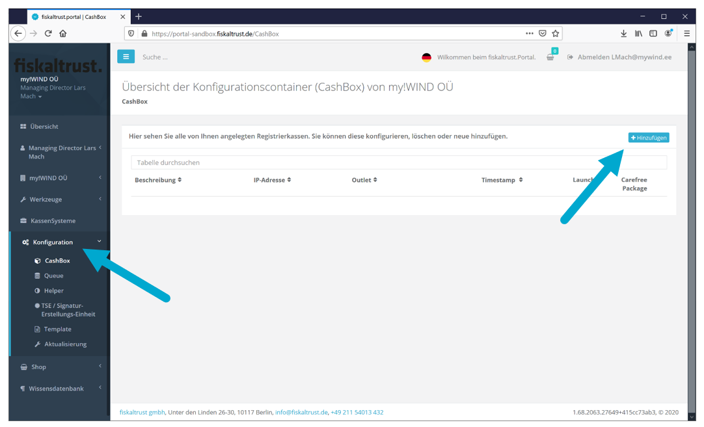
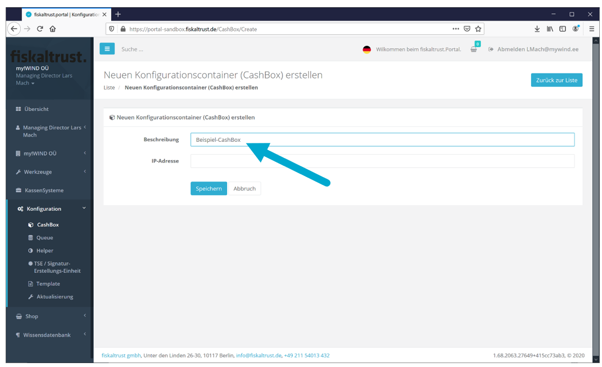
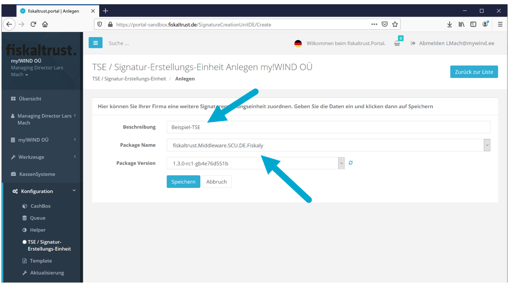
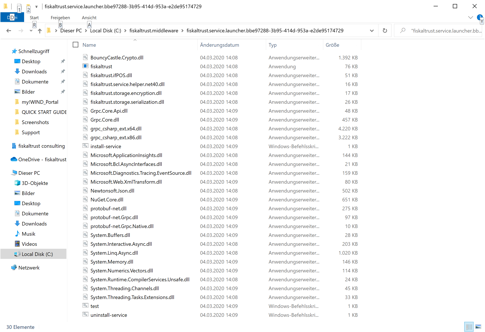

Einleitung
==========

Im Rahmen der Kassensicherungsverordnung (KassenSichV) müssen Registrierkassen
Belege manipulationsgeschützt abspeichern.

Hierzu werden Technische Sicherheitseinrichtungen (TSE) eingesetzt.

fiskaltrust.Middleware bietet die bequeme Einbindung von TSE aller Hersteller an
Ihre Registrierkasse, sowie eine vereinfachte Umsetzung der Anforderungen der
Digitalen Schnittstelle der Finanzverwaltung für Kassensysteme (DSFinV-K).

Neben der kostenlosen fiskaltrust.Middleware bieten wir AddOn-Produkte an, die
den Kassenalltag sehr erleichtern, beispielsweise durch automatisiertes
Speichern der Kassendaten mit Konformitätserklärung und DATEV-Schnittstelle,
auch im Rahmen attraktiver Sorglos-Pakete.

Dieses Dokument bietet einen Schnelleinstieg. Den vollen Funktionsumfang des
Portals lernen Sie im Portal-Benutzerhandbuch kennen.

Das Benutzerhandbuch sowie eine Dokumentation der fiskaltrust.Middleware nebst
Code-Sammlungen für Aufrufe liegen unter <https://fiskaltrust.de/dokumente>.

Begrifflichkeiten
-----------------

CashBox Konfigurationscontainer (Auswahl TSE, Betriebssystem u.a.)

Launcher App zum Installieren der Middleware auf Kassenrechner

Middleware Dienstprogramm (Service/Daemon; läuft auf Kassenrechner)

TSE Technische Sicherheitseinrichtung (zur Verschlüsselung)

Dokument Status
---------------

| Rev | Änderung           | geändert von            | Änderungsdatum |
|-----|--------------------|-------------------------|----------------|
| 00  | Dokumenterstellung | Lars Mach, Kaya Cürünay | 28.02.2020     |
| 01  | Version 1.0        | Lars Mach               | 05.03.2020     |

Grundlegende Schritte
=====================

Der Prozess zur Fiskalisierung einer Kasse mit der fiskaltrust.Middleware  
besteht im Wesentlichen aus vier Schritten:

Registrierung im Portal

Antwort-Email mit Log-In Daten

CashBox konfigurieren

Auswahl TSE, Betriebssystem-Umgebung usw.

CashBox herunterladen

CashBox (Middleware) auf Kassen-PC laden und starten

Aufrufe an Middleware senden

Beleg-/Vorgangsdaten senden, Antwort (Signatur) erhalten

Registrierung im fiskaltrust.Portal
===================================

Bevor es losgehen kann, laden wir Sie ein, sich unverbindlich und kostenfrei in
unserem fiskaltrust.Portal zu registrieren.

Den Link dorthin finden Sie auf unserer Webseite <https://fiskaltrust.de> in der
oberen Menüleiste.

Bei einer Neu-Registrierung werden Daten Ihrer Organisation angelegt, sowie ein
Zugang zu unserem Portal.

*Ein Bestätigungslink wird Ihnen per E-Mail zugesandt; diesen klicken Sie an.*

*Eine Registrierung ist Voraussetzung für den Zugang zu unserem Portal*

Sie erhalten

-   kostenlosen Support (Einrichtungsfragen, Umsetzung der DSFinV-K)

-   Zugang zu einer Entwicklungsumgebung („sandbox“)

-   die Möglichkeit zur Konfiguration der kostenlosen fiskaltrust.Middleware

-   Zugriff auf einen Webshop zum Erwerb von Add-On-Services und TSE

Die umfangreichen Tools und Angebote des fiskaltrust.Portals werden auf den
nachfolgenden Seiten beschrieben.

**Registrierung im Portal:**

1.  PORTAL aufrufen (https://fiskaltrust.de, oben rechts)

2.  „Registrieren“ wählen

3.  Firmendaten eingeben

4.  Bestätigungsemail abwarten, dort Bestätigungslink anklicken

5.  In die sich öffnende Portalseite ein eigenes Passwort eingeben

Portal: Aufbau und Funktionen
-----------------------------

Das Portal umfasst neben Funktionen wie der Konfiguration einer CashBox auch die
Auswahl einer Rolle (Kassenbetreiber, -händler, -hersteller), Zugang zu Ihren
Stammdaten (mit Editier-Funktion), eine Auflistung Ihrer Kassensysteme, einen
Webshop und vieles andere.

Für eine gründliche Einführung in alle Funktionen nutzen Sie bitte das Portal
Benutzerhandbuch (unter <https://fiskaltrust.de/faq/dokumente>).

Rollenmodell
------------

Im Portal werden verschiedene Rollen unterschieden, mit denen verschiedene
Funktionen verknüpft sind.

-   *Klicken Sie unter Ihrem Konto auf „Übersicht“ und wählen Sie Ihre Rolle
    aus.*

Sobald Sie einen der Schieberegler aktivieren, erscheint ein dazugehöriger
Vertrag, den Sie zur Aktivierung Ihrer Rolle im Unterschriftsfeld bestätigen
müssen. Nach Annahme des Vertrags wird Ihnen eine separate E-Mail zugehen; den
Vertrag können Sie sich im Portal als PDF herunterladen.

-   **KassenHersteller**

Hersteller von Registrierkassen

-   **KassenHändler**

Vertrieb von Registrierkassen

-   **KassenBetreiber**

Nutzer einer Kasse (Restaurant, Ladengeschäft usw.)

-   **KassenBerater**

Unternehmensberater u.ä.

Es kann mehr als eine Rolle zutreffen; z.B. Kassenhersteller und -händler.
Hierzu sind die entsprechenden Rollen auszuwählen.

CashBox konfigurieren
=====================

Eine CashBox ist ein Konfigurationscontainer, der individuell ausgewählte
Komponenten für die Fiskalisierung einer Kasse zusammenfasst und der
Identifikationsnummer („CashBoxId“) zuordnet. Dies können TSE verschiedener
Hersteller sein, aber auch „Helper“ zur Erweiterung des Funktionsumfangs der
CashBox.

Sie können auch nach der Einrichtung einer CashBox und deren Komponenten einige
Anpassungen im Portal vornehmen – Komponenten wie „Helper“ sogar austauschen.

Um eine CashBox anzulegen und zu konfigurieren müssen Sie sich in unserer
Sandbox registrieren - unserer Testumgebung (unter
<https://portal-sandbox.fiskaltrust.de>).

Neue CashBox anlegen
--------------------

Klicken Sie im linken Menü auf „Konfiguration“ um auf die Übersicht zu gelangen,
wählen Sie dort „CashBox“ und klicken auf „+ Hinzufügen“.

In das Feld „Beschreibung“ schreiben Sie Ihren CashBox-Namen und klicken auf
„Speichern“. Das Feld „IP-Adresse“ können Sie frei lassen.

Ihre Cashbox wird jetzt in der Cashbox-Übersicht angezeigt.

S

Queue konfigurieren
-------------------

Die Queue sammelt die Belege und ist für das Erzeugen der Belegkette
verantwortlich; sie stellt das Receipt Journal und das ActionJournal zur
Verfügung.

Klicken Sie im linken Menü auf „Queue“, dann auf den Button „+ Neu anlegen“:

In das Feld „Beschreibung“ schreiben Sie Ihren Queue-Namen und wählen das
zutreffende Datenbank-Package aus (z.B. fiskaltrust.Middleware.Queue.SQLite für
Windows).

*Zum Inhalt von „CashBox Identification“ beachten Sie bitte nachfolgende
Hinweise!*

*Achtung: Die „CashBox Identification“ ist nicht identisch mit der „CashBoxId“
(CashBox).*

Zum besseren Verständnis wird dieser Bezeichner im Queue-Menü zukünftig
umbenannt werden.

*Der Inhalt von „CashBox Identification“ in der Queue hängt von der gewählten
TSE ab:*

-   Cryptovision „CashBox Identification“ Wert beliebig

Es ist im folgenden Schritt ein Schlüssel hinzuzufügen (siehe dort)

-   fiskaly „CashBox Identification“ = „client ID” (wird von fiskaly vergeben)

-   Swissbit [Information folgt]

Nach Drücken von “Speichern” gelangen Sie auf nachfolgendes Fenster:

Zur Kommunikation mit der Queue stehen http, net.pipe und grpc zur Verfügung.  
**! Bei Verwendung einer Cryptovision TSE darf „grpc“ nicht an erster Stelle der
Liste stehen;**  
**es MUSS stets ein grpc Endpunkt in der Queue vorhanden sein,**  
**auch wenn Alternativen wie http:// verwendet werden sollen.**

Die URL werden bei Auswahl automatisch generiert (Ausnahme: grpc, Daten siehe
oben).  
Achten Sie darauf, *keine identischen URLs* zu benutzen (d.h. notfalls manuell
ändern).

Klicken Sie anschließend auf den Button „Speichern und schließen“;  
Ihre Queue wird jetzt in der Queue-Übersicht angezeigt.

*Die Middleware auf dem Kassenrechner wird mit der Queue kommunizieren,*  
*um Aufrufe zu senden und Antworten zu empfangen.*

Helper
------

Helper sind optionale Komponenten die einer Cashbox hinzugefügt werden können,
um erweiterte Funktionen zur Verfügung zu stellen (z.B. „mono-Launcher“ für
Betrieb mit LINUX).

In der nachfolgenden Grafik werden Ihnen die zur Verfügung stehenden Helper
gezeigt, diese Liste wird von Zeit zu Zeit aktualisiert.

*Für die Konfiguration einer funktionsfähigen Middleware dieses QuickGuides ist
der Einsatz eines Helpers nicht erforderlich; der Hinweis auf Helper ist hier
rein informativ.*

TSE festlegen und konfigurieren
-------------------------------

Nach der Einrichtung einer CashBox und dem Anlegen einer Queue ist eine TSE
auszuwählen; diese muss anschließend der Queue zugeordnet werden.

Die Technische Sicherheitseinrichtung (TSE) wird eingesetzt, um Belege zu
signieren und Belegdaten in der TSE selbst zu speichern.

Wir bieten in unserem Portal TSE diverser Anbieter, deren Zahl laufend den am
Markt verfügbaren Produkten angepasst wird.

Aktuell finden Sie im fiskaltrust.Portal TSE von

-   Cryptovision

-   Epson

-   Swissbit

-   fiskaly

Zum Auswählen und Einrichten einer TSE wählen Sie im Menü links
„TSE/Signatur-Erstellungs-Einheit“ und klicken im Fenster auf „+Anlegen“.

Es öffnet sich eine Eingabemaske, in die Sie Ihrer TSE einen Namen geben.  
Sonach wählen Sie unter „Package Name“ die gewünschte TSE in der ausklappenden
Liste aus und klicken Sie auf den Button „Speichern“.

Sie geben die Zugangsdaten ein, die Sie mit Ihrer TSE erhalten haben und wählen
analog zur Queue-Einrichtung einen Kommunikationsweg aus (URL wird generiert).  
Nach dem Klicken auf den Button „Speichern und schließen“ erscheint folgende
Übersicht:

*Nachdem alle erforderlichen Komponenten konfiguriert sind,*  
*werden diese im nächsten Schritt einer CashBox zugeordnet.*

CashBox aufbauen
----------------

Um mit den konfigurierten Komponenten aus den vorherigen Schritten eine
funktionsfähige CashBox aufzubauen, klicken Sie im linken Menü auf „CashBox“.

Per Drag&Drop ziehen Sie 1) die Queue und 2) die TSE von der rechten Seite auf
die linke.

Die CashBox ist nun konfiguriert und kann gespeichert werden (Button
„Speichern“).

In der CashBox Übersicht sehen Sie Ihre Konfiguration mit wichtigen Daten:

-   CashBoxId

-   Access token

-   Queue-URL (Queue-Zugang/-Zugänge für Aufrufe der Middleware)

TSE mit Queue verknüpfen
------------------------

Ein letzter wichtiger Schritt ist die Verknüpfung der TSE mit der Queue.

Es öffnet sich ein Fenster, in dem Sie die TSE auswählen und aktivieren (linker
Radio-Button):

CashBox herunterladen
=====================

Aus der im Kapital „CashBox konfigurieren“ aufgebauten CashBox wird ein
Dienstprogramm für den Kassencomputer erzeugt: *Die fiskaltrust.Middleware!*

Dazu wird im Portal ein „Launcher“ generiert, der komprimiert per ZIP-Format auf
den Kassencomputer heruntergeladen werden kann.

Es kann entschieden werden zwischen einem

-   Online-Launcher

>   Diese Variante wird bei bestehender Internetverbindung automatisch
>   aktualisiert; beispielsweise nach einer Anpassung der CashBox im
>   fiskaltrust.Portal

-   Offline-Launcher

>   Besteht im Kassencomputer keine Internetverbindung oder ist automatisches
>   Aktualisieren nicht gewünscht, ist der Offline-Launcher die geeignete Wahl.  
>   Es gibt eine zweite Variante „mono UseOffline Launcher“ für
>   Linux-Umgebungen.

Rebuild der CashBox
-------------------

*Bevor Sie einen der Launcher runterladen, ist ein Rebuild der CashBox
durchzuführen;*  
*dies ist nach jeder Änderung an der CashBox-Konfiguration erforderlich!*

Zum Auslösen eines „Rebuild“ drücken Sie auf das graue Rebuild-Symbol ( ).  
Der Vorgang kann etwas Zeit in Anspruch nehmen; beachten Sie bitte die
Statuszeile (unten).

Launcher herunterladen und entpacken
------------------------------------

Nach dem Rebuild kann zwischen drei Launcher-Varianten der Middleware gewählt
werden:

Durch Anklicken eines der drei Felder wird ein Download-Vorgang gestartet; die
ZIP-Datei muss gespeichert werden (noch nicht geöffnet).

Die ZIP-Datei ist in einen frei zugänglichen Ordner zu entpacken (Berechtigungen
beachten!), so dass die Kassensoftware darauf Zugriffsrechte besitzt – siehe
unten: Entpackte Dateien

Installieren des Dienstes
-------------------------

Die fiskaltrust.Middleware wird mit dem heruntergeladenen Launcher in einem
Comand Line Interpreter gestartet, um fortan als Dienst im Hintergrund auf dem
Kassenrechner zu laufen.

*Der Launcher (d.h. der Command Line Interpreter) ist im Administrator-Modus zu
starten.*

Es gibt zum Testen einen Launcher, der nicht fest installiert wird:

test.cmd

Zur dauerhaften Installation auf dem Kassencomputer wird „install-service.cmd“
gestartet.

Starten des Dienstes
--------------------

Nach dem Starten des Dienstes werden diverse Komponenten installiert und
registriert; dies kann besonders bei der Online-Variante des Launchers eine
Weile dauern, da große Pakete aus dem fiskaltrust.Portal heruntergeladen werden
müssen.

Sobald der Dienst (test.cmd) einsatzbereit ist, erscheint die Zeile:

**„fiskaltrust.service started. Press a button to stop…”**

Screenshot: Anzeige nach dem Starten von test.cmd (Online Launcher)

Aufrufe an Middleware senden
============================

Sobald der Dienst (fiskaltrust.Middleware) auf dem Kassencomputer im Hintergrund
läuft, können an diesen Anfragen gesendet werden (Belege signieren, Journaldaten
abrufen oder ein einfaches „echo“ zum Testen der Aufrufschnittstellen).

Endpunkte für Aufrufe
---------------------

Die Endpunkte der fiskaltrust.Middleware für Client Aufrufe sind

baseUrl (lt.Portal)/v0/journal  
baseUrl (lt.Portal)/v1/sign  
baseUrl (lt.Portal)/v1/echo

Für JSON-Aufrufe baseUrl (lt.Portal)/json/v0/journal  
baseUrl (lt.Portal)/json/v1/sign  
baseUrl (lt.Portal)/json/v1/echo

Für XML-Aufrufe baseUrl (lt.Portal)/xml/v0/journal  
baseUrl (lt.Portal)/xml/v1/sign  
baseUrl (lt.Portal)/xml/v1/echo

**Beispiel:
http://localhost:1200/bbe97288-3b95-414d-953a-e2de95174729/json/v1/sign**

Die „baseURL“, sowie wichtige Header-Daten zum Aufruf des Dienstes finden Sie in
Ihrer CashBox im fiskaltrust.Portal (CashBoxId und Access Token sind direkt
herauskopierbar):

 Beispiel: REST-Aufruf mit Postman
-------------------------------------

Mit Programmen wie „Postman“ können Sie Clients simulieren, um Anfragen an die
Middleware zu senden und von dort Antworten zu empfangen.

Im Header werden die Keys „cashboxid“ und „accesstoken“ definiert und
CashBox-Werten aus der Konfiguration im fiskaltrust.Portal zugewiesen;
content-Type ist „accplication/json“.

Es wird nach dem REST-Konzept kommuniziert und „POST“ verwendet, Einstiegspunkt
ist:

http://localhost:1200/bbe97288-3b95-414d-953a-e2de95174729/json/v1/sign  
(siehe „Endpunkte für Aufrufe“ und vgl. Queue-URL im Portal)

./media/image32.png
-------------------

ReceiptRequest JSON-Aufruf – mit Response

Zusätzliche Dokumentationen & Support
=====================================

JSON Beispiel Dokumentation
---------------------------

Weitere Dokumentation und Beispiele in JSON finden Sie in unseren Dokumenten

Deutsch: „[fiskaltrust Geschäftsvorfälle in
JSON](https://fiskaltrust.de/wp-content/uploads/sites/5/2020/02/fiskaltrust-Business-Cases-in-JSON_deutsch-2.pdf)“

Englisch: „[fiskaltrust Business
Cases](https://fiskaltrust.de/wp-content/uploads/sites/5/2020/02/fiskaltrust-Business-Cases-in-JSON_englisch.pdf)“

unter dem Link https://fiskaltrust.de/faq/dokumente/

Interface Dokumentation
-----------------------

Darüber hinaus finden Sie weitere Hinweise und den gesamten Befehlssatz der
Middleware in unserer Schnittstellen-Dokumentation:

„[fiskaltrust-Interface-Doc](https://fiskaltrust.de/wp-content/uploads/sites/5/2020/02/fiskaltrust-interface-doc_2020-02-19.pdf)“

Nächste Schritte
----------------

Nach erfolgreichem anlegen einer CashBox empfehlen wir Ihnen sich mit unserer
Interface Dokumentation bekannt zu machen <https://fiskaltrust.de/dokumente/>

Support
-------

Bei Fragen steht Ihnen der fiskaltrust Support unter <info@fiskaltrust.de> zur
Verfügung.
